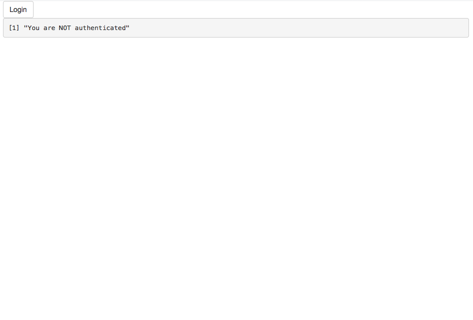
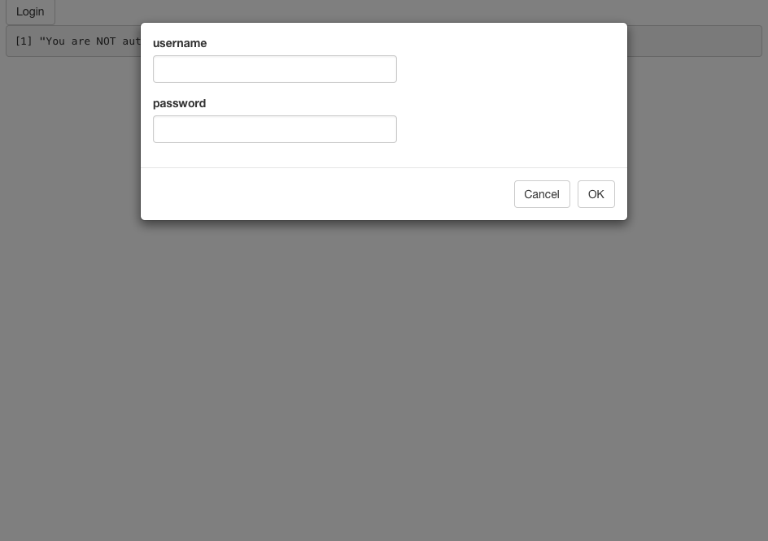
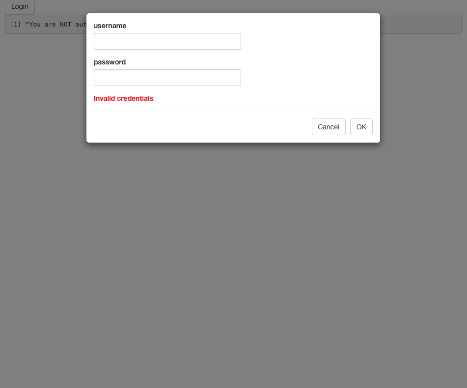
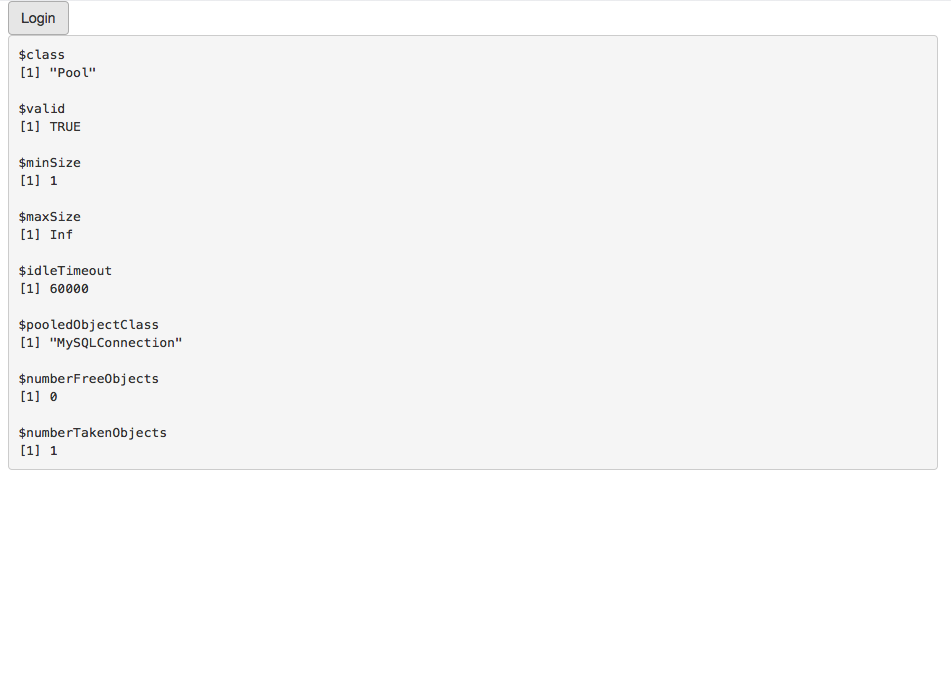

# vault-shiny-app

This is a not-so-secure app to serve as a proof of concept of how we might integrate Vault in R to secure credentials. 
In reality, we'd need to bake this security right into the inputs, rather then after Shiny has registered these. But
it may still to useful to get a feel as to how this may work in the future.

Before you move on, you need to download and install Vault, which is pretty simple. Just follow the instructions 
[here](https://www.vaultproject.io/intro/getting-started/install.html).

Then, download this app and unzip it. Open a terminal window and cd into wherever this is: `cd vault-shiny-app`.
Type the following to get the vault server up and running: `vault server -config=api-test.hcl`. You should see 
output similar to:

```
==> Vault server configuration:

                 Backend: file
              Listener 1: tcp (addr: "127.0.0.1:8200", tls: "disabled")
               Log Level: info
                   Mlock: supported: true, enabled: false
                 Version: Vault v0.6.0

==> Vault server started! Log data will stream in below:
```

In order for this app to run, you need to have the most recent development version of `Shiny` and `pool`, as well as
the CRAN version of `httr`:

```r
devtools::install_github("rstudio/shiny")
devtools::install_github("rstudio/pool")
install.packages("httr")
```

Now, you can run the app. You should see the following:



Click the `Login` button, which will open a modal window and prompt you for your username and password:



Try whichever combination you want and click `Ok`. The app will try to connect a shiny demo database, but since you
passed wrong credentials, you should see the following:



In addition, you console will print an error message similar to:

```
Listening on http://127.0.0.1:****
Error in .local(drv, ...) : 
  Failed to connect to database: Error: Access denied for user 'wrong'@'*********' (using password: YES)
```

Now, try the correct credentials. Username = `guest` and Password = `guest` as well. The app tries again to connect
to the database and succeeds this time. After less than a second, the page should update and show you some information
about the pool you are connecting to:



===========
**To relaunch the app, you will need to clear away the previous vault's storage (which in this case, uses the local file system and creates a new directory called `vault` at the same level as the app. Delete that directory. Then, exit the current server (Control + C) and start a new one just as before (with `vault server -config=api-test.hcl`).**
